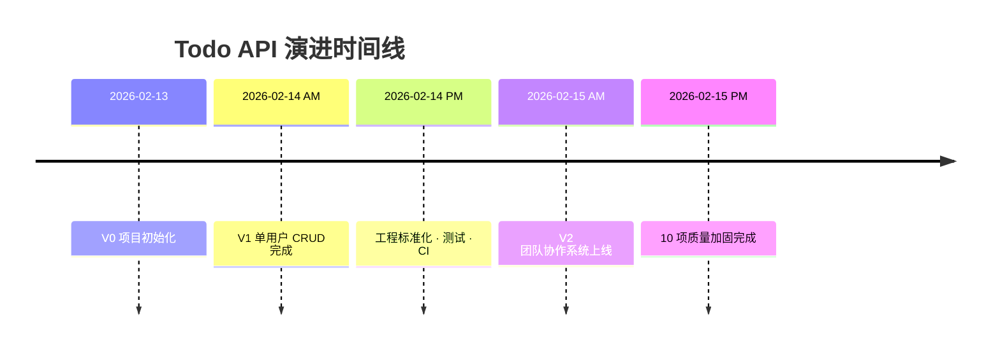

# 📊 Todo API 项目迭代演进记录

> **项目**：Todo API（Python + FastAPI + SQLAlchemy）
> **时间跨度**：2026-02-13 → 2026-02-15
> **最后更新**：2026-02-15

---

## 迭代总览

```
V0 (Day 1)        V1 (Day 2)                  V2 (Day 2-3)
脚手架搭建    →    单用户 Todo CRUD    →    团队协作系统 + 工程加固
```



---

## V0 — 项目脚手架（Day 1）

**目标**：搭好专业项目的骨架，建立开发规范。

| 完成项 | 说明 |
|--------|------|
| 项目结构 | `src/app/` 分层布局（models / schemas / routers） |
| 虚拟环境 | `.venv/` + `requirements.txt` 依赖锁定 |
| 配置管理 | `config.py` + `.env` 环境变量分离 |
| 数据库连接 | 异步 SQLAlchemy + SQLite |
| 版本控制 | `.gitignore` 排除敏感文件和编译产物 |

**核心学习**：项目结构设计、环境隔离、配置与代码分离。

---

## V1 — 单用户 Todo CRUD（Day 2 上午）

**目标**：实现一个完整的 RESTful API，支持待办事项的增删改查。

### 数据模型

```
todos 表
├── id          (主键, 自增)
├── title       (标题, 必填)
├── description (描述, 可选)
├── is_done     (完成状态)
├── created_at  (创建时间)
└── updated_at  (更新时间)
```

### API 端点

| 方法 | 路径 | 功能 |
|------|------|------|
| `POST` | `/todos/` | 创建待办 |
| `GET` | `/todos/` | 获取列表（分页） |
| `GET` | `/todos/{id}` | 获取详情 |
| `PATCH` | `/todos/{id}` | 部分更新 |
| `DELETE` | `/todos/{id}` | 删除 |

**核心学习**：RESTful 设计、Pydantic 数据验证、ORM 操作、依赖注入。

---

## V1.5 — 工程标准化（Day 2 下午）

**目标**：补齐专业项目必备的工程实践。

| 完成项 | 说明 |
|--------|------|
| JWT 认证 | 用户注册 / 登录 / Token 鉴权 |
| 密码安全 | bcrypt 哈希存储 |
| 请求日志 | 中间件记录每个请求的方法、路径和耗时 |
| 自动化测试 | pytest + httpx 异步测试 |
| CI 流水线 | GitHub Actions 自动跑测试 |
| API 文档 | FastAPI 自动生成 Swagger UI |
| 代码规范 | Ruff 代码检查 + MyPy 类型检查 |
| Docker | Dockerfile + docker-compose.yml |

**核心学习**：认证安全、中间件、自动化测试、CI/CD、容器化。

---

## V2 — 团队协作系统（Day 3 上午）

**目标**：从单用户工具升级为多人团队协作平台。这是架构上的跨越式升级。

### 新增数据模型

```
workspaces (工作空间)          workspace_memberships (成员关系)
├── id                        ├── workspace_id  ──→ workspaces.id
├── name                      ├── user_id       ──→ users.id
├── created_by ──→ users.id   └── role (owner / admin / member)
└── timestamps
                              projects (项目)
tasks (任务)                  ├── workspace_id  ──→ workspaces.id
├── workspace_id              ├── name
├── project_id  ──→ projects  ├── created_by
├── title / description       └── timestamps
├── status (状态机)
├── assignee_id               task_comments / task_tags / task_watchers
├── due_at                    audit_logs / idempotency_keys
├── version (乐观锁)
└── timestamps
```

### 新增功能矩阵

| 功能 | 说明 |
|------|------|
| **工作空间** | 多租户数据隔离，CRUD + 成员管理 |
| **RBAC 权限** | owner / admin / member 三级角色控制 |
| **项目管理** | 工作空间内的项目 CRUD（仅管理员） |
| **任务管理** | 创建、分页列表、筛选（状态/标签/指派人/截止日期）、排序 |
| **状态机** | `todo → in_progress ⇄ blocked → done`，禁止非法跳转 |
| **乐观并发** | `version` 字段防止并发修改冲突 |
| **幂等性** | `Idempotency-Key` 头防止重复创建 |
| **评论** | 任务评论 CRUD，仅作者可编辑 |
| **标签** | 任务标签添加/删除，支持按标签筛选 |
| **关注者** | 任务关注人管理 |
| **审计日志** | 全量操作记录，敏感字段脱敏 |
| **数据库迁移** | Alembic 三阶段迁移（创建新表 → 迁移数据 → 删除旧表） |

### 旧表处理

```
Phase A: 创建 V2 新表（workspaces, tasks, projects 等）
Phase B: 数据迁移（旧 todos → 新 tasks）
Phase C: 删除旧 todos 表 ← 回不去了，这是单向的
```

**核心学习**：多租户架构、RBAC、状态机、乐观锁、幂等性、数据库迁移策略。

---

## V2.1 — 质量加固（Day 3 下午）

**目标**：基于代码评审，系统性修复 10 项代码质量和安全问题。

### 高优先级

| # | 改进 | 影响 |
|---|------|------|
| 1 | `get_db` 返回类型修正为 `AsyncGenerator` | 类型正确性 |
| 2 | 测试辅助函数提取到 `tests/helpers.py` | 消除 4 处代码重复 |
| 3 | 清理遗留 `Todo` 模型和 Schema 引用 | 消除死代码 |
| 4 | `SECRET_KEY` 生产环境安全检查 | 安全防护 |

### 中优先级

| # | 改进 | 影响 |
|---|------|------|
| 5 | 自定义业务异常替代 `HTTPException` | Service 层解耦 |
| 6 | CORS 中间件配置 | 跨域支持 |
| 7 | `list_tasks` 过滤逻辑去重 | 可维护性 |

### 低优先级

| # | 改进 | 影响 |
|---|------|------|
| 8 | 日志增强（文件轮转 + JSON 格式） | 生产可观测性 |
| 9 | Ruff 规则扩展（+isort +bugbear） | 代码质量 |
| 10 | PEP 561 `py.typed` 标记 | 类型检查支持 |

**核心学习**：代码评审、异常分层设计、日志策略、工具链配置。

---

## 架构演进对比

```
V1 架构（两层）                    V2 架构（三层 + 横切关注点）

  Router ←→ Database                Router
                                      ↓
                                    Service  ←→  Custom Exceptions
                                      ↓
                                    Database

                                    + Middleware (CORS, Logging)
                                    + Permissions (RBAC)
                                    + Audit Logging
                                    + Idempotency
```

## 数量指标对比

| 指标 | V1 | V2.1 |
|------|-----|------|
| 数据模型 | 1 (Todo) | 11 (Workspace, Project, Task...) |
| API 端点 | 5 | 20+ |
| Service 文件 | 0 | 8 |
| 测试用例 | 6 | 24 |
| 代码行数 | ~500 | ~3000+ |
| 安全机制 | 无 | JWT + RBAC + 数据隔离 |

---

> **📌 总结**：这个项目展示了一个 API 从"能跑"到"能用于生产"的完整演进路径——
> 从最简单的 CRUD 开始，逐步加入认证、测试、多租户、权限、并发控制、审计和工程规范。
> 每一步迭代都对应着真实项目中必然会遇到的需求升级。
